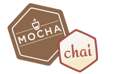

# Lección 1: Intro a : Testear en Node.js usando Mocha y Chai

* Node.js
* Testear en Node.js usando Mocha y Chai
* Mocha
* Chai

## Node.js

Node.js es un código abierto de JavaScript. Diseñado para generar apps web de forma altamente optimizada.
Desde su lanzamiento por el año 2009 ha logrado convertirse en todo un must dentro del desarrollo web.
Node.js abre nuevas oportunidades para el desarrollo. Ahora los programadores pueden usar JavaScript tanto en el front-end como en el back-end. Node.js es un entorno de código abierto, en tiempo de ejecución multiplataforma, asíncrono, con I/O de datos en una arquitectura orientada a eventos y que se basa en el motor V8 de Google. 

 

Ryan Dahl, el inventor de Node.js, afirma que al estar inspirado en aplicaciones como Gmail, tenía la intención de diseñar un sistema para crear sitios web con capacidad de inserción en tiempo real. Por lo tanto, la programación dirigida por eventos se convirtió en el corazón de Node.js.

node

## Testear en Node.js usando Mocha y Chai
A la hora de verificar que el código funciona, ¿Pruebas manualmente todas las funciones de la app para asegurar que el nuevo código no rompa con la funcionalidad existente?

¿Y cuando se está arreglando un bug? ¿Pruebas manualmente tu app?

Las pruebas unitarias son vitales para asegurar la calidad de nuestro producto. Mocha y Chai nos facilitan la creación de pruebas unitarias muy completas para los desarrollos en JavaScript.

¿Qué permite testear las apps?
Ayuda a descomponer los problemas en las piezas manejables.
Obliga a los QA Tester a entender y escribir un código más limpio.
Te permite saber que tu código realmente funciona, lo que es un alivio.
Pruebas unitarias guiadas por comportamiento
Este proceso de desarrollo de software es esencialmente una idea sobre cómo el desarrollo de software debe ser administrado tanto por el entendimiento técnico como por los intereses del negocio.

Este tipo de pruebas unitarias se centran en el comportamiento de los usuarios, en lugar de en las funciones técnicas del software. Se utiliza un lenguaje fácil de entender para asegurar que todos los integrantes del equipo no se pierdan en los procesos, incluyendo las personas que no tengan un perfil técnico. Se trata de una solución a los desafíos de automatización y colaboración.

## Mocha

Mocha es un framework de pruebas de JavaScript con numerosas funciones que se ejecuta en Node.js y en el navegador. Las pruebas de Mocha se ejecutan en serie, lo que permite informes flexibles y precisos.

Como hemos dicho, Mocha es un framework de pruebas. Eso significa que se utiliza para organizar y ejecutar pruebas.

Al escribir una prueba, hay dos funciones básicas que debe tener en cuenta: describe() and it().

describe(): Es simplemente una forma de agrupar nuestras pruebas en mocha.

it(): Se utiliza para un caso de prueba individual. it(): toma dos argumentos, una cadena que explica lo que debe hacer la prueba y una función de devolución de llamada.

Ofrece bastantes opciones

Hooks:
Se colocan dentro de un elemento de tipo describe(). Son muy útiles para algo tan necesario como inicializar una variable, limpiar la base de datos, etc.

Exclusive Tests:
La función only() hace posible ejecutar solo el bloque o caso de prueba al que se lo añadamos. Es muy útil cuando tenemos un gran número de tests y queremos ejecutar solo una parte de ellos o incluso un único test.

Inclusive Tests:
La función skip() se comporta de forma opuesta a only(). Con skip podemos hacer que, durante una ejecución, no se ejecute un bloque o incluso un test dentro del mismo. Es muy útil cuando tenemos un bloque de tests o solo un test que no queremos que se ejecute.

## Chai

Ahora veamos algo de Chai
Chai es una librería de aserciones, que se puede emparejar con cualquier marco de pruebas de JavaScript. Chai tiene varias interfaces: assert, expect y should. Que permiten al programador elegir un estilo que le resulte más legible a la hora de desarrollar los test.

Interfaces y estilos de aserción
Hay dos formas populares de afirmación en Chai, expect y should
La interfaz de expect proporciona una función para la afirmación.
La interfaz should extiende cada objeto con una propiedad should para la aserción.
La propiedad should se agrega al Object.Prototype, para que todos los objetos puedan acceder a ella a través de la cadena de prototipos.
 

En los procesos de desarrollo de cualquier producto con expectativas de satisfacer al público objetivo siempre ha existido una fase de pruebas o testeo para comprobar su funcionalidad.  Como expertos en transformación digital, reconocemos que realizar pruebas es algo imprescindible. Nos permite garantizas que las apps cumplen con las funcionalidades que se esperan de ellas y superan las expectativas de calidad, no solo de código. El poder identificar los errores y defectos permite reducir los costes del desarrollo y afianzar a los clientes al evitar molestos errores en las soluciones digitales desarrolladas.