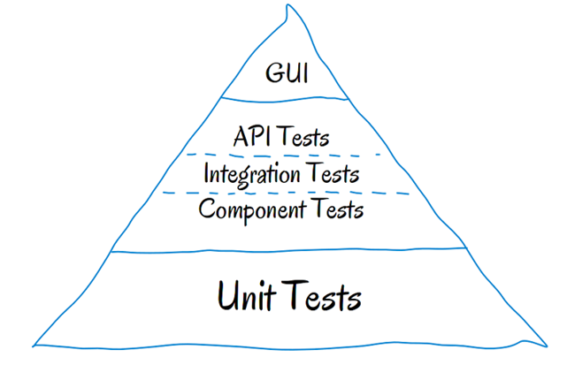

# Lección 1: mocha.js y chai.js

* Mocha.js
* Chai.js
* Test con mocha y chai
* It
* Describe
* Ejemplo / Ejercicio I
* Ejemplo / Ejercicio II
* Terminos y traducciones utilizados en este Readme
* Fuentes


  ## Mocha.js
  Mocha es un framework de prueba JavaScript rico en características que se ejecuta en Node.js y en el navegador, haciendo que las pruebas asincrónicas sean simples y divertidas. También podemos crear pruebas síncronas.

Las pruebas de Mocha se ejecutan en serie, lo que permite informes flexibles y precisos, al tiempo que asigna excepciones no detectadas a los casos de prueba correctos.

## Chai.js
chai es una librería de aserción BDD / TDD (Ver definiciones en este readme) que nos facilita el uso de mocha y chai tiene varias interfaces: assert, expect y should (Ver traducciones en este readme),

vamos usar chai ya que nos permite usar cualquier tipo de interfaz más adelante podemos ver el uso de algunas de ellas.

Chai se puede combinar maravillosamente con cualquier marco de prueba de JavaScript.

## ¿Qué significan las siglas TDD?:
TDD o Test-Driven Development (desarrollo dirigido por tests) es una práctica de programación que consiste en escribir primero las pruebas (generalmente unitarias), después escribir el código fuente que pase la prueba satisfactoriamente y, por último, refactorizar el código escrito.

## ¿Qué es BDD (Behavior Driven Development)?
BDD es una estrategia de desarrollo dirigido por comportamiento, empatizando con el usuario final de tus desarrollos.

## Test con mocha y chai

Vamos a comenzar con el testing de nuestras aplicaciones web en este caso con mocha y chai, chai es una librería de aserción que nos facilita el uso de mocha y chai tiene varias interfaces: assert, expect y should, en este post vamos usar chai ya que nos permite usar cualquier tipo de interfaz más adelante podemos ver el uso de algunas de ellas.

Ahora que es mocha y que son las pruebas unitarias y para qué sirven, mocha es un framework de prueba JavaScript rico en características que se ejecuta en Node.js y en el navegador, haciendo que las pruebas asincrónicas sean simples y divertidas. También podemos crear pruebas síncronas.

Una prueba unitaria es una forma de comprobar el correcto funcionamiento de una unidad de código. Por ejemplo en diseño estructurado o en diseño funcional una función o un procedimiento, en diseño orientado a objetos una clase. 

Esto sirve para asegurar que cada unidad funcione correctamente y eficientemente por separado. Además de verificar que el código hace lo que tiene que hacer, verificamos que sea correcto el nombre, los nombres y tipos de los parámetros, el tipo de lo que se devuelve, que si el estado inicial es válido entonces el estado final es válido. Fuente: Wikipedia.

Mocha y chai nos permiten crear pruebas unitarias muy completas para nuestro desarrollo de forma simple y divertida en JavaScript. Esto nos permite acercarnos a cumplir con la pirámide de cohn, la pirámide de pruebas de Mike Cohn, descrita en su libro Succeeding with Agile, ha sido un referente en este campo durante mucho tiempo. En ella Cohn establece que hay varios niveles de pruebas, y señala el grado en el que deberíamos automatizarlas.

Piramide


Bueno en este artículo vamos a crear algunos ejemplos para implementar test unitarios con npm, mocha y chai. 
Npm es el gestor de paquetes JavaScript de Node.js en otras palabras nos permite descargar librerías o paquetes tienen que tener Node.js instalado ya que npm viene con Node.js

## Ejemplo I
(Ver Video en plataforma)

"test": "node ./node_modules/mocha/bin/_mocha"


## Ejercicio para Ejemplo I
Crear otro metodo en la carpeta main.js
Agregar sus respectivos test en mainTest 
Investigar y utilizar 2 metodos de assert (no pueden ser los que vimos en los ejemplos y videos)

## Ejemplo II
Uso de las diferentes interfaces que nos trae chai.
```javascript
/* Should */
chai.should();

foo.should.be.a('string');
foo.should.equal('bar');
foo.should.have.lengthOf(3);
tea.should.have.property('flavors')
  .with.lengthOf(3);

/* Expect */
var expect = chai.expect;

expect(foo).to.be.a('string');
expect(foo).to.equal('bar');
expect(foo).to.have.lengthOf(3);
expect(tea).to.have.property('flavors')
  .with.lengthOf(3);

/* Assert */
var assert = chai.assert;

assert.typeOf(foo, 'string');
assert.equal(foo, 'bar');
assert.lengthOf(foo, 3)
assert.property(tea, 'flavors');
assert.lengthOf(tea.flavors, 3);
```
Como podemos ver todas tienen una forma diferente de implementar las pruebas ahora vamos a un ejemplo desde cero.

Lo primero es como dije tener instalado npm que ya viene con Node.js bien ahora creamos un packege.json con npm init --yes en alguna parque de nuestro equipo desde la terminal veamos paso a paso.

Creamos un folder para nuestros tests.
mkdir tests_mocha

Creamos el fichero package.json. Este fichero es utilizado por npm para tener toda la información de nuestro proyecto como son las dependencias de desarrollo y producción entre otras cosas.
npm init --yes

Ahora vamos a instalar la librería de mocha con npm y agregamos la bandera --sabe-dev para que sea una dependencia de desarrollo.
npm install mocha --save-dev

Creamos un folder más llamado test donde van a estar todos nuestros tests y creamos un archivo test.js.

mkdir test
Agregamos el siguiente código y usamos la librería de aserción assert que viene por defecto con nodejs, en otros ejemplos usaremos chai.
```javascript
const assert = require('assert');
describe('Array', function() {
  describe('#indexOf()', function() {
    it('should return -1 when the value is not present', function() {
      assert.equal([1,2,3].indexOf(4), -1);
    });
  });
});
```
En nuestro test tenemos la siguiente estructura el describe y el it que son:

## describe

En esta parte definimos bloques de pruebas podemos tener varios bloques de pruebas y relacionarlos entre sí en otras palabras es una descripción general de nuestras pruebas.

## It

Los it se refiere a cada una de las pruebas es decir dentro de un describe podemos tener varios it que son las pruebas de esos describe.

Esta es una de las estructuras más sencillas usando mocha.js, no es la única estructura que existe ya que mocha nos permite tener más tipo de estructuras que no serán mencionadas en este post.

Ahora bien volviendo a nuestro primer test unitario para correrlo vamos a la terminal y nos ubicamos en la raíz y corremos el comando npm test para que funcione debemos modificar el package.json agregando lo siguiente en la parte de scripts:
```javascript
    "test": "node ./node_modules/mocha/bin/_mocha"
```

El test pasa porque estamos esperando un -1 ya que el valor 4 no está en el array que le estamos pasando, indexOf es una función de javascript el cual nos devuelve 1 si se encuentra el valor y -1 si no se encuentra.

Ahora vamos a crear un test con un script de algunas operaciones matemáticas, bien lo primero instalar chai con npm install chai --save lo siguiente importar el módulo de chai y también importar nuestro script de operaciones.

```javascript
const assert    = require('chai').assert;
const expect    = require('chai').expect;
const should = require('chai').should();

const Operations = require('../src/app.js');
```
Ahora si vamos a los test los divide en 3 describe donde existen operaciones matemáticas y en cada una de ellas uso un tipo de aserción gracias a chai para ver las diferencia y su manera de aplicarlo.

```javascript
describe('Mathematical operations', () => {
  const operation = new Operations(10, 5);

  describe('Basic operation: sum with assert', () => {
    it('Sum of 2 numbers equals 15', () => {
      const sum = operation.sum.value;
      assert.equal(sum, 15);
    })

    it('The sum of 10 + 5 equals 15 ', () => {
      const sum = operation.sum.text;
      assert.equal(sum, 'La suma de 10 + 5 = 15');
    })

    it('The result is a string', () => {
      const sum = operation.sum.text;
      assert.typeOf(sum, 'string');
    })

    it('The result is a number', () => {
      const sum = operation.sum.value;
      assert.typeOf(sum, 'number');
    })

  })

  describe('Basic operation: subtraction with expect', () => {
    it('Subtraction of 2 numbers equals 5', () => {
      const res = operation.subtraction.value;
      expect(res).to.equal(5);
    })

    it('The subtraction of 10 - 5 equals 5 ', () => {
      const res = operation.subtraction.text;
      expect(res).to.equal('La resta de 10 - 5 = 5');
    })

    it('The result is a string', () => {
      const res = operation.subtraction.text;
      expect(res).to.be.a('string');
    })

    it('The result is a number', () => {
      const res = operation.subtraction.value;
      expect(res).to.be.a('number');
    })
  })

  describe('Basic operation: area of a triangle with should', () => {
    it('Area of triangle with base 10 x height 5 equal 25', () => {
      const area = operation.area.value;
      area.should.equal(25);
    })

    it('Area of triangle equals 25 ', () => {
      const area = operation.area.text;
      area.should.equal('El área del triángulo es 25');
    })

    it('The result is a string', () => {
      const area = operation.area.text;
      area.should.be.a('string');
    })

    it('The result is a number', () => {
      const area = operation.area.value;
      area.should.be.a('number');
    })
  })
})
```
Las operaciones matemáticas están en la carpeta src/ un file app.js, el cual llamamos en los test para aplicar los test.

Por ultimo solo nos queda ir a la terminal y correr el comando npm test y verificar que todos los test pasen, como dije antes mocha tiene otro tipo de estructuras que veremos mas adelante, para mas información podes visitar la documentación de mocha.

## Ejercicio para Ejemplo II
Crear los archivos correspondientes con operaciones y metodos para poder realizar el test del ejemplo II

## Terminos y traducciones utilizados en este Readme.

* foo: Foo o foobar es un término genérico ampliamente usado para aludir a cualquier entidad informática cuyo nombre se ignora o no se quiere expresar.

* assert: Afirmar

* expect:Esperar

* should: Debería

¿Qué significan las siglas TDD?: TDD o Test-Driven Development (desarrollo dirigido por tests) es una práctica de programación que consiste en escribir primero las pruebas (generalmente unitarias), después escribir el código fuente que pase la prueba satisfactoriamente y, por último, refactorizar el código escrito.

¿Qué es BDD (Behavior Driven Development)?
BDD es una estrategia de desarrollo dirigido por comportamiento, empatizando con el usuario final de tus desarrollos.

* Framework
¿Qué es un Framework?
Cuando necesitas desarrollar un proyecto, con una estructura definida, y que la compatibilidad de sus funcionalidades esté asegurada, es recomendable usar un Framework.

Un framework te da toda la estructura para un proyecto completo, desde el inicio hasta el final, integrando funcionalidades sin depender de librerías externas, por ejemplo:

Si necesitas validar formularios, el framework te trae la validación de formularios.
Si necesitas imprimir datos en pantalla, el framework te trae la forma de imprimir esos datos.
Además un framework asegura la compatibilidad entre sus componentes y te da el marco de cómo debes trabajar. No tienes tanta libertad como si usaras una librería, pero tienes todas las soluciones empaquetadas que te dicen como se debe hacer el proyecto e incluso como mandar a producción, mientras que con las librerías tienes que ir armando el proyecto pieza por pieza.

* Libreria

¿Qué es una Librería?
Es un conjunto de funcionalidades, que resuelven necesidades específicas del proyecto, empaquetadas y reutilizables.

El ejemplo del carrito de compras que vimos anteriormente, solo nos servirá para nuestro proyecto, por lo que su uso es para algo muy específico. Hay librerías que se pueden utilizar para proyectos de forma general.


Para entenderlo de una forma muy simple, las principales diferencias entre librerías y frameworks son que un framework nos proporciona un marco de trabajo para desarrollar aplicaciones, mientras que las librerías únicamente solucionan un problema concreto, haciendo el código más fácil de leer.

Una de las librerías más usadas en proyectos web, es React.JS (apoyada por Facebook).

Lo genial de las librerías, es que las puedes combinar con otras, por ejemplo:

Necesito una librería que me ayude a manejar las fechas (usas la librería de fechas)
Necesito una librería que haga drag and drop (usas la librería drag and drop)
Necesito una librería para manejar el DOM (usas la librería DOM)
Y vas formando la estructura de tu proyecto, como más te guste, en el orden que tú quieras.

Esta libertad de elegir la estructura de tu proyecto, va de la mano con que siempre debas controlar la compatibilidad de cada una de ellas.

## Fuentes:
node.js
https://nodejs.org/es/

mocha.js
https://mochajs.org/

chai.js
https://www.chaijs.com/

assert
https://www.chaijs.com/api/assert/

expecty should
https://www.chaijs.com/api/bdd/


