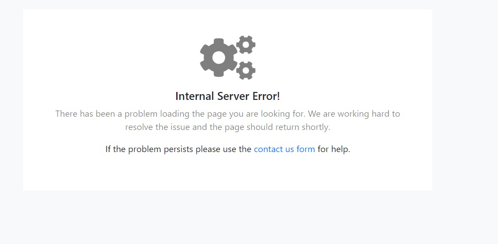
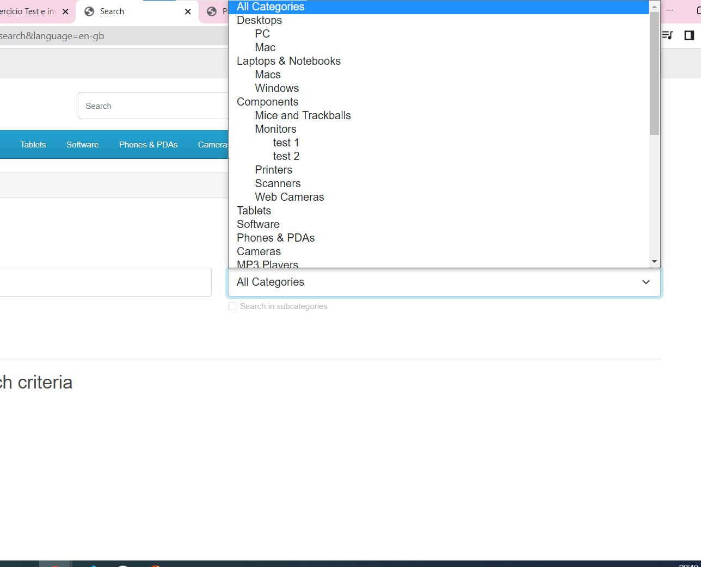
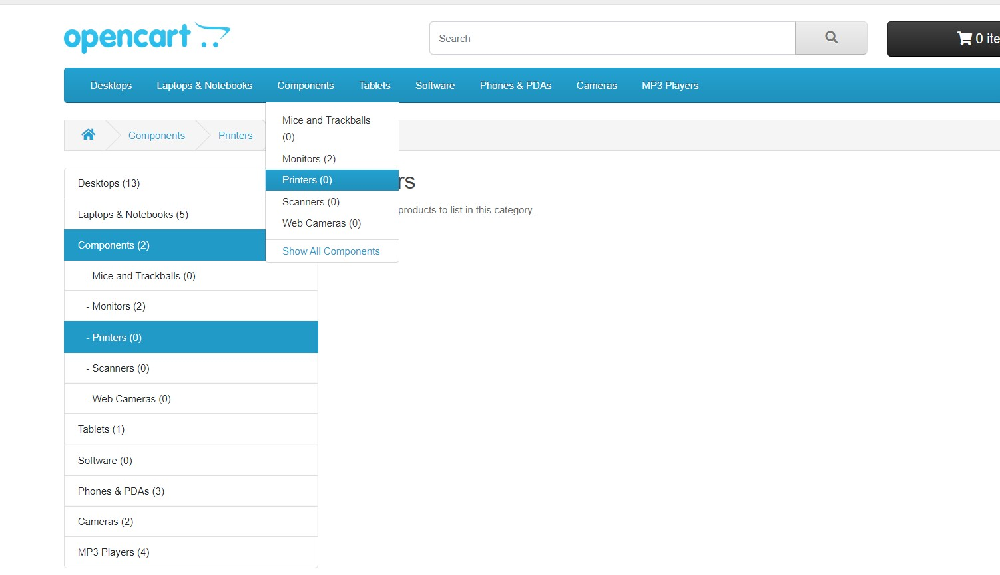
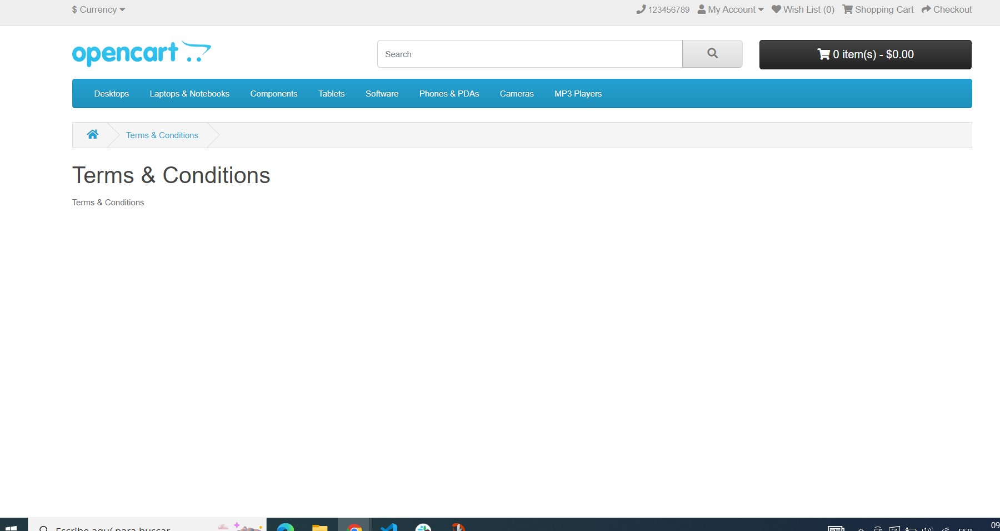
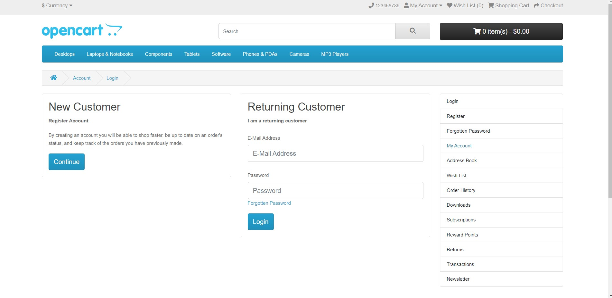
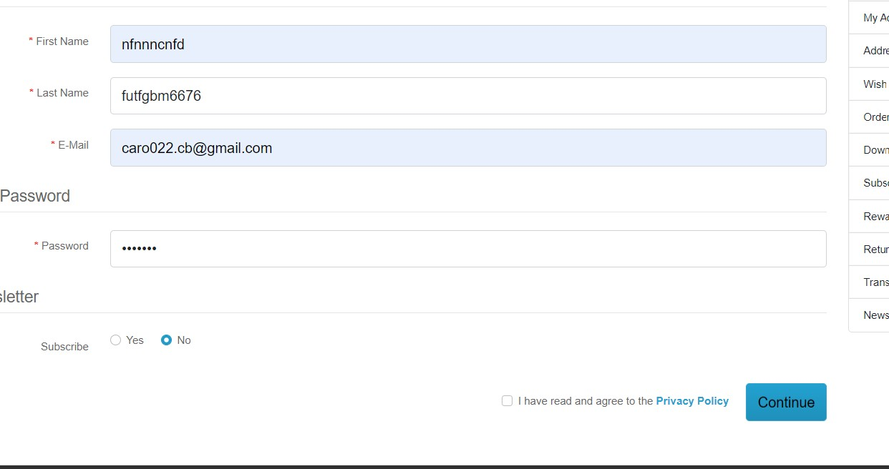
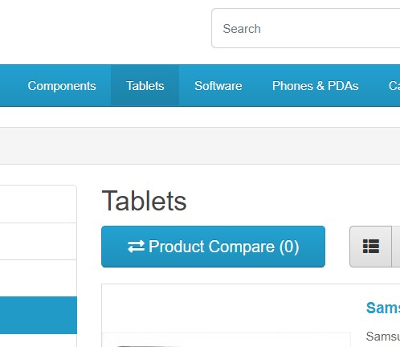

pagina: https://demo.opencart.com/index.php?route=common/home&language=en-gb 

========================================================================

caso 1 : Error 500/busqueda 

1- La barra de busqueda no muestra resultados

2- como acceder al error

a- ingresar a la pagina principal

b- escribir en la barra de busqueda

c- clickear el boton de busqueda 

3- 

4- sugerencia: deberían mostrarse páginas que coincidan con los resultados (agregar vistas, links)

=========================================================================

caso 2 : 

1- Lista desplegable de busqueda avanzada en posicion opuesta 

2- como acceder al error

a- ingresar a la pagina principal 

b- en la barra de busqueda, oprimir el boton de busqueda sin escribir contenido 

c- clickear el boton de busqueda 

d- desplegar el menu de categorias 

3- 

4- sugerencia: desplegar la barra hacia abajo para que no ocupe contenido relevante de la página

===========================================================================

caso 3 : 

1- Barra desplegable con contenido irrelevante/sin contenido

2- como acceder al error

a- ingresar a la pagina principal 

b- explorar en la barra de categorias cada una de ellas
 

3- 

4- sugerencia: Agregar contenido ó eliminar aquellas que no lo poseen

=============================================================================

caso 4 : 

1- Error: falta de contenido 

2- como acceder al error

a- ingresar a la pagina principal 

b- En el footer seleccionar 
 

3- 

4- sugerencia: Agregar contenido ó eliminar aquellas que no lo poseen

=============================================================================

caso 5:

1- Links sin contenido/no funcionan

2- 
a- acceder al login de la página
b- acceder a los links del menu lateral

3- 

4-sugerencia: Agregar ruta del link o eliminar etiqueta de no ser necesaria

==============================================================================

caso 6:

1- Error en el envío del formulario de registro

2- 

a- acceder a login 

b- completar el formulario con datos erroneos (ej:numeros en nombre ) ó dejar sin completar/sin marcar casilla de politica de privacidas y enviar 

3- 

4-sugerencia: Revisar validaciones en los formularios

================================================================================

caso 7:

1- Comparacion entre productos no da respuesta

2- 
a- acceder a la página principal
b- hacer click sobre producto y en comparar

3- 

4-sugerencia: Comprobar el funcionamiento del boton, elemento faltante.

