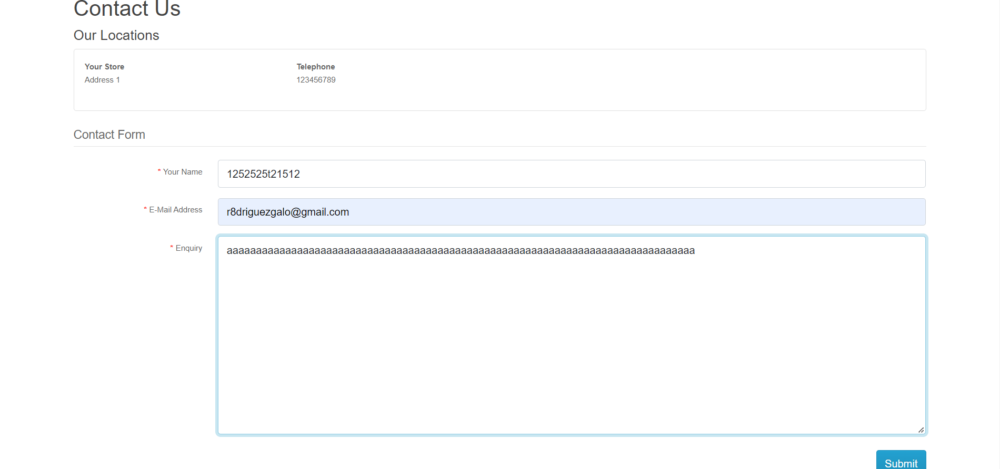

Caso 1:

en la página principal las flechas que alternan entre las imagenes del celular y las laptops se distorcionan

Ubicación:

1- ingrese en la página principal "Your store"

2- Las imagenes debajo de la barra de navegación que rotan con unas flechas

3- Clikear levemente fuera de las flechas de rotación

sugerencia: eliminar el efecto de distorsión en las flechas rotatorias, evita que se pueda clickear correctamente

==========================================================================================

Caso 2:

la barra de productos no tiene menú desplegable en algunos elementos

Ubicación:

1- ingrese en la página principal "Your store"

2- la barra azul que contiene los productos debajo de la barra de navegación 

sugerencia: agregar menú desplegable a "tablets", "software", "phones & PDA" y "cameras"

==========================================================================================

Caso 3:

barra de navegación da error 500 al escribirle productos y darle a buscar

Ubicación:

1- ingrese en la página principal "Your store"

2- barra de navegación en la parte superior de la página

sugerencia: enlazar la barra de navegación con las diversas páginas creadas

==========================================================================================

Caso 4:

en el registro acepta todo tipo de nombres incluyendo números y se envia

Ubicación:

1- ingrese en la página principal "Your store"

2- en la esquina superior derecha encima del carrito de compras se encuentra "my account"

3- darle click e ingresar en "register"

sugerencia: restringir el uso de números en los campos de nombre y apellido, darle un limite de caracteres a utilizar 

==========================================================================================

Caso 5:

Nuevamente flechas distorsionadas en las imagenes de las marcas

Ubicación:

1- ingrese en la página principal "Your store"

2- vaya hacia abajo del todo en la página

3- en las imagenes rotatorias que contiene logos de marcas

sugerencia: eliminar el efecto de distorsión en las flechas rotatorias, evita que se pueda clickear correctamente

==========================================================================================

Caso 6:

"información" no contiene datos

Ubicación:

1- ingrese en la página principal "Your store"

2- descienda hasta el final de la página, en el lado izquierdo

"Terms & conditions", "delivery information", "about us", "privacy policy" no contienen información

sugerencia: agregar información a los campos correspondientes

==========================================================================================

Caso 7: 

la sección de "contactanos" valida cualquier caracter o número como nombre para enviar el formulario

Ubicación:

1- ingrese en la página principal "Your store"

2- descender hasta el final de la página

3- en "customer service" ingrese en "contact us"

sugerencia: restringir el uso de números en el campo de nombre y darle un limite de caracteres a utilizar 

==========================================================================================

Caso 8:

Product return acepta información incorrecta

Ubicación:

1- ingrese en la página principal "Your store"

2- descender hasta el final de la página

3- en "customer service" ingrese en "returns"

sugerencia: restringir el uso de números en los campos donde se rellena el nombre y apellido, restringir el uso de letras y caracteres en el campo "telephone"

==========================================================================================

Caso 9:

No se añaden los elementos que selecciono al carrito de compras

Ubicación:

1- ingrese en la página principal "Your store"

2- Descienda hasta la zona media de la pág con el que contiene el titulo featured

==========================================================================================

Caso 10:

lista despegable va hacia arriba

Ubicación:

1- ingrese en la página principal "Your store"

2- en la barra de navegación al inicio de la pág solo precione el icono de la lupa

sugerencia: hacer que la lista desplegable vaya hacia abajo

