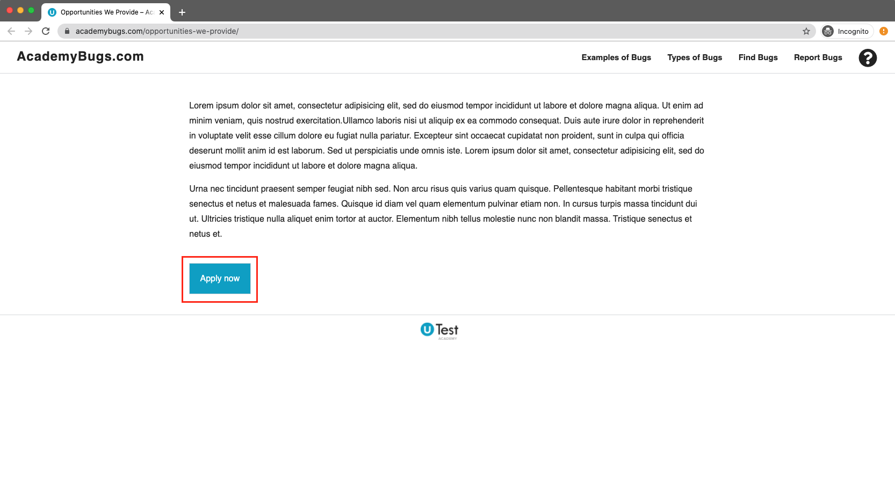
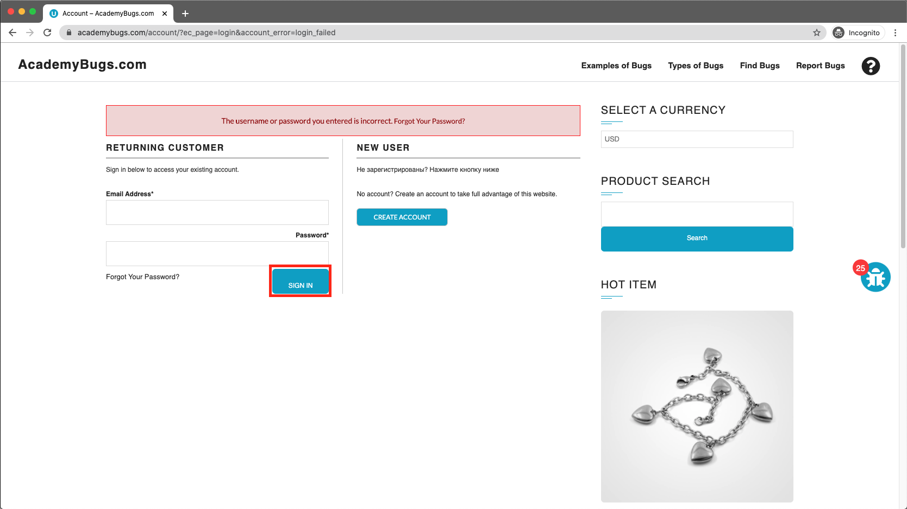
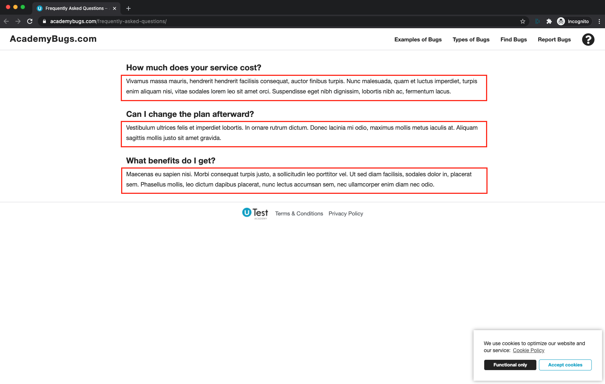
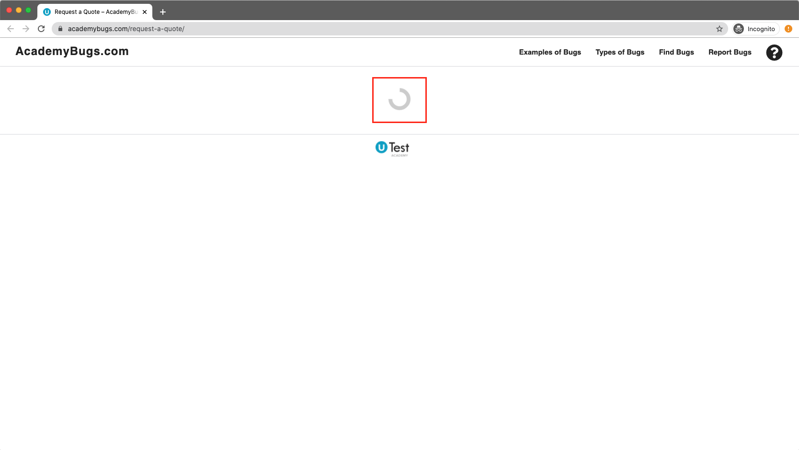
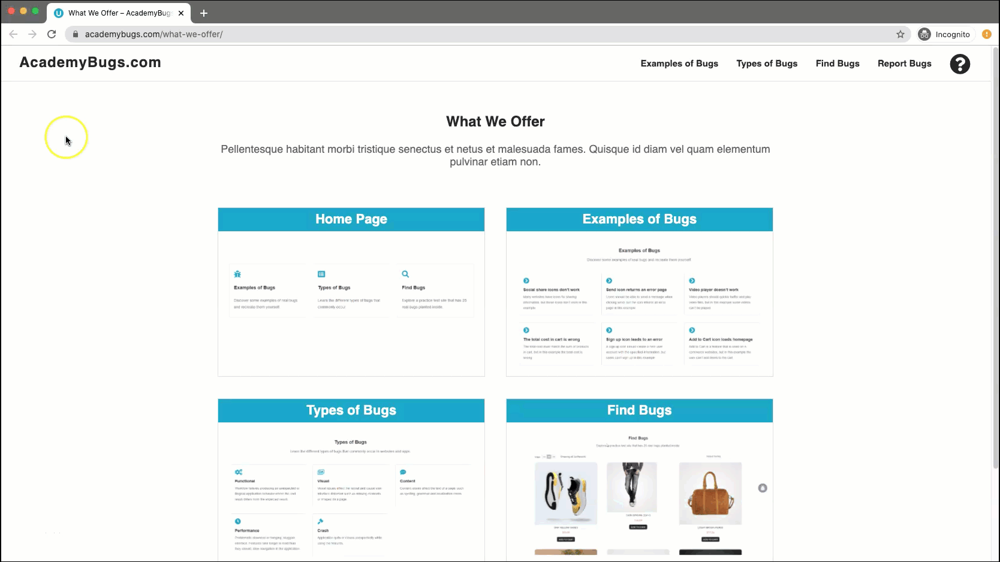

<h1>Tipo de Errores</h1>

<h2>Funcional</h2>
Fallos de flujo de trabajo que producen un comportamiento de aplicación inesperado o ilógico donde el resultado real difiere del resultado esperado.

Gravedad:
Medio

Tipo de problema:
Funcional

Frecuencia:
Cada vez

Ambiente:
Todos los navegadores

Resultado Esperado:
Para ver una página apropiada después de hacer clic en el botón

Resultado actual:
No pasa nada al hacer clic en el botón.

 
<h2>Visual</h2>
Los problemas visuales afectan el diseño y provocan distorsiones en la interfaz de usuario, como la falta de elementos o imágenes en una página.

Gravedad:
Bajo

Tipo de problema:
Visual

Frecuencia:
Cada vez

Ambiente:
Todos los navegadores

Resultado Esperado:
El título del campo de contraseña se alinea igual que el campo anterior

Resultado actual:
El título del campo de contraseña no está alineado de la misma manera que el campo anterior

 
<h2>Contenido</h2>

Los problemas de contenido afectan el texto de una página, como errores de ortografía, gramática y localización.

Gravedad
Bajo

Tipo de problema
Contenido

Frecuencia
Cada vez

Ambiente
Todos los navegadores

Resultado Esperado
Ver la pagina en ingles

Resultado actual
Algunas partes de la página no están traducidas.

<h2>actuación</h2>

Lentitud problemática o interfaz colgante y lenta. Las características tardan más en cargarse de lo que deberían, navegación lenta en la aplicación.

Gravedad:
Alto

Tipo de problema:
Actuación

Frecuencia:
Cada vez

Ambiente:
Todos los navegadores

<h2>Choque</h2>

La aplicación se cierra o se cierra inesperadamente mientras usa las funciones.

Gravedad
Crítico

Tipo de problema
Choque

Frecuencia
Cada vez

Ambiente
Todos los navegadores

Resultado Esperado
La segunda página se abre como se esperaba.

Resultado actual
Toda la página, incluidos los enlaces y los botones, deja de responder.