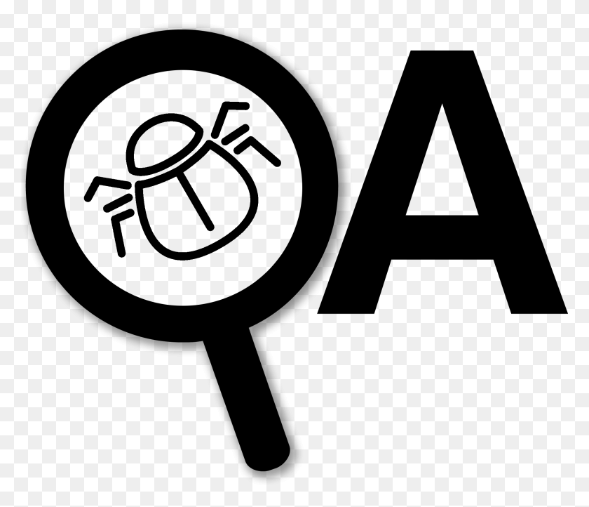

**========================================================================================**

#  **QA: Ejecución e investigación**

## Tipos de Errores

Fuente: https://academybugs.com/types/#

* Contenido

Los problemas de contenido afectan el texto de una página, como errores de ortografía, gramática y localización.

Gravedad
Bajo

Frecuencia
Cada vez

* Visual

Los problemas visuales afectan el diseño y provocan distorsiones en la interfaz de usuario, como la falta de elementos o imágenes en una página.

Gravedad
Bajo

Frecuencia
Cada vez

* Funcional

Fallos de flujo de trabajo que producen un comportamiento de aplicación inesperado o ilógico donde el resultado real difiere del resultado esperado.

Gravedad
Medio

Frecuencia
Cada vez

* Actuación

Lentitud problemática o interfaz colgante y lenta. Las características tardan más en cargarse de lo que deberían, navegación lenta en la aplicación.

Gravedad
Alto

Frecuencia
Cada vez

* Choque 

La aplicación se cierra o se cierra inesperadamente mientras usa las funciones.

Gravedad
Crítico

Frecuencia
Cada vez

