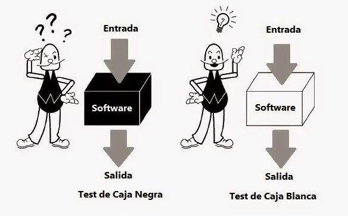

**========================================================================================**

# **QA: Ejecución e investigación**

## Tipos de Pruebas

Fuentes: https://programacionymas.com/blog/tipos-de-testing-en-desarrollo-de-software, pdfs.

+ **Pruebas unitarias**

-Consiste en probar de forma individual las funciones y/o métodos.
-Comprueba el funcionamiento correcto de una unidad de código.

Estas pruebas verifican que el nombre de la función o método sea adecuado, que los nombres y tipos de los parámetros sean correctos, y así mismo el tipo y valor de lo que se devuelve como resultado.

+ **Pruebas de Integración**

Las pruebas de integración verifican que los diferentes módulos y/o servicios usados por nuestra aplicación funcionen en armonía cuando trabajan en conjunto.

Por ejemplo: pueden probar la interacción con una o múltples bases de datos, o asegurar que los microservicios operen como se espera.

+ **Pruebas Funcionales**

Las pruebas funcionales se centran en los requerimientos de negocio de una aplicación.

Estas pruebas verifican la salida (resultado) de una acción, sin prestar atención a los estados intermedios del sistema mientras se lleva a cabo la ejecución.

Los requisitos funcionales pueden estar descritos en productos de trabajo tales como especificaciones de requisitos de negocio, épicas, historias de usuario, casos de uso, o especificaciones funcionales, o pueden estar sin documentar. Las funciones describen "qué" debe hacer el sistema.

+ **Pruebas No Funcionales**

La prueba no funcional de un sistema evalúa las características de sistemas y software, como la usabilidad, la eficiencia del desempeño o la seguridad.

+ **Pruebas end-to-end**

Las pruebas de punta a punta replican el comportamiento de los usuarios con el software, en un entorno de aplicación completo.
Las pruebas end-to-end son muy útiles, pero son costosas de realizar; y pueden ser difíciles de mantener cuando son automatizadas.

+ **Pruebas de regresión**

Tiene la funcionalidad de descubrir bugs, carencias en la funcionalidad, divergencias funcionales, entre otras en el comportamiento de un software que sufrió modificaciones en el programa.

El objetivo específico de estas pruebas es asegurar que el sistema sigue funcionando correctamente luego de un cambio realizado. 

+ **Pruebas de humo**

Las pruebas de humo son pruebas que verifican la funcionalidad básica de una aplicación.

No debe tener incidencias que no permitan su operatividad. Son las primeras pruebas que debemos realizar en la entrega de una funcionalidad/sistema.

Son un conjunto de pruebas automatizadas de alto nivel, y seleccionadas estrictamente.
Tienen lugar entre las pruebas de integración y las pruebas de regresión. Y están ahí para verificar que la funcionalidad principal del sitio opera como es debido.

* **Pruebas de aceptación**

Las pruebas de aceptación son pruebas formales, ejecutadas para verificar si un sistema satisface sus requerimientos de negocio.

Son usualmente un conjunto de pruebas manuales que se realizan luego de que una fase de desarrollo ha finalizado (de modo que se pueda volver rápidamente e iterar si algo no está correcto).

Verifican que la características de nuestro software estén alineadas con todas las especificaciones iniciales y criterios de aceptación.

Suelen realizarse luego de las pruebas unitarias o de integración, para evitar que se avance mucho con el proceso de prueba, y determinar a tiempo si se necesitan cambios significativos.

* **Pruebas de rendimiento**

Las pruebas de rendimiento verifican cómo responde el sistema cuando éste se encuentra bajo una alta carga.

El objetivo de las pruebas de rendimiento es determinar el rendimiento del sistema bajo una carga de trabajo definida utilizando diferentes tipos de pruebas de rendimiento tales como pruebas de carga, de estrés y de estabilidad.

La prueba de rendimiento es una técnica de prueba de software no funcional que determina cómo la estabilidad, la velocidad, la escalabilidad y la capacidad de respuesta de una aplicación se mantiene bajo una determinada carga de trabajo

## Pruebas de Cajas

* **Caja Negra** 

Prueba la funcionalidad de un sistema/aplicación. 

• Se basan en: 
Requisitos de la aplicación 
Especificación técnica 
• Utilizadas en cualquier tecnología (web, desktop, mobile).

* **Caja Blanca**

La prueba de caja blanca obtiene pruebas basadas en la estructura interna del sistema o en su 
implementación.  La estructura interna puede incluir código, arquitectura, flujos de trabajo y/o flujos de datos dentro del sistema.
Se puede medir la intensidad de la prueba de caja blanca a través de la cobertura estructural.  
La cobertura estructural es la medida en que algún tipo de elemento estructural ha sido practicado 
mediante pruebas, y se expresa como un porcentaje del tipo de elemento cubierto.

