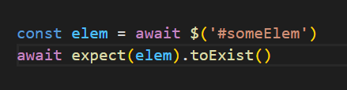
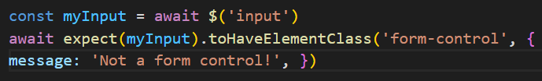
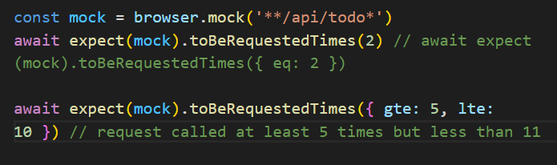

 ◇ COMPARADORES DE NAVEGADOR

 • toHaveUrl:
 
  Comprueba si el navegador está en una página específica.

 

 • toHaveUrlContaining:

 Comprueba si el navegador está en una URL de página que contiene un valor.

 

 • toHaveTitle:

 Comprueba si el sitio web tiene un título específico.

 

 • toHaveTitleContaining:

Comprueba si el sitio web tiene un título específico que contiene un valor.

 

----------------------------------------------------------------------------

◇COINCIDENCIAS DE ELEMENTOS

 • toBeDisplayed:

Las llamadas se muestran en el elemento dado.

 

 • toExist:

Llama a isExisting en un elemento dado.

 

 • toBePresent:

Igual que toExist

 

 • toBeExisting: 

Igual que toExist

 

 • toBeFocused:

Comprueba si el elemento tiene foco. Esta afirmación solo funciona en un contexto web.

 

 • toHaveAttribute

Comprueba si un elemento tiene un determinado atributo con un valor específico.

 

 • toHaveAttr:

La misma que toHaveAttribute.

 

 • toHaveAttributeContaining:

Comprueba si un elemento tiene un determinado atributo que contiene un valor.

 

 • toHaveAttrContaining:

Lo mismo que toHaveAttributeContaining

 

 • toHaveElementClass:

Comprueba si un elemento tiene un cierto nombre de clase.

 

 • toHaveElementClassContaining:

Comprueba si un elemento tiene un cierto nombre de clase que contiene el valor proporcionado.

 

 • toHaveElementProperty:

Comprueba si un elemento tiene una determinada propiedad.

 

 • toHaveValue:

Comprueba si un elemento de entrada tiene un valor determinado.

 

 • toHaveValueContaining:

Comprueba si un elemento de entrada contiene un cierto valor.

 

 • toBeClickable:

Comprueba si se puede hacer clic en un elemento llamando a isClickable en el elemento.

 

 • toBeDisabled:

Comprueba si un elemento está deshabilitado llamando a isEnabled en el elemento.

 

 • toBeEnabled:

Comprueba si un elemento está habilitado llamando a isEnabled en el elemento.

 

 • toBeSelected:

Comprueba si un elemento está habilitado llamando a isSelected en el elemento.

 

 • toBeChecked:

Igual a toBeSelected

 

 • toHaveHref:

Comprueba si el elemento de enlace tiene un destino de enlace específico.

 

 • toHaveLink:

Igual a toHaveHref

 

 • toHaveHrefContaining:

Comprueba si el elemento de enlace contiene un objetivo de enlace específico.

 

 • toHaveLinkContaining:

Igual a toHaveHrefContaining

 

 • toHaveId:

Comprueba si el elemento tiene un atributo de identificación específico.

 

 • toHaveText:

Comprueba si el elemento tiene un texto específico. También se puede llamar con una matriz como parámetro en el caso de que el elemento pueda tener diferentes textos.

 

 • toHaveTextContaining:

Comprueba si el elemento contiene un texto específico. También se puede llamar con una matriz como parámetro en el caso de que el elemento pueda tener diferentes textos.

 

 • toBeDisplayedViewport:

Comprueba si un elemento está dentro de la ventana gráfica llamando a isDisplayedInViewport en el elemento.

 

 • toHaveChildren:

Comprueba la cantidad de elementos secundarios del elemento obtenido llamando al comando element.$('./*').

 

 • toBeElementsArrayOfSize:

Comprueba la cantidad de elementos obtenidos mediante el comando $$.

 

----------------------------------------------------------------------------

◇ COINCIDENCIAS DE RED

 • toBeRequested:

Comprueba que se llamó al simulacro

 

 • toBeRequestedTimes:

Comprueba que se llamó al simulacro la cantidad de veces esperada

 

 • toBeRequestedWith:

Comprueba que se llamó al simulacro de acuerdo con las opciones esperadas.

La mayoría de las opciones admiten comparadores parciales expect/jasmine como expect.objectContaining
 
  
